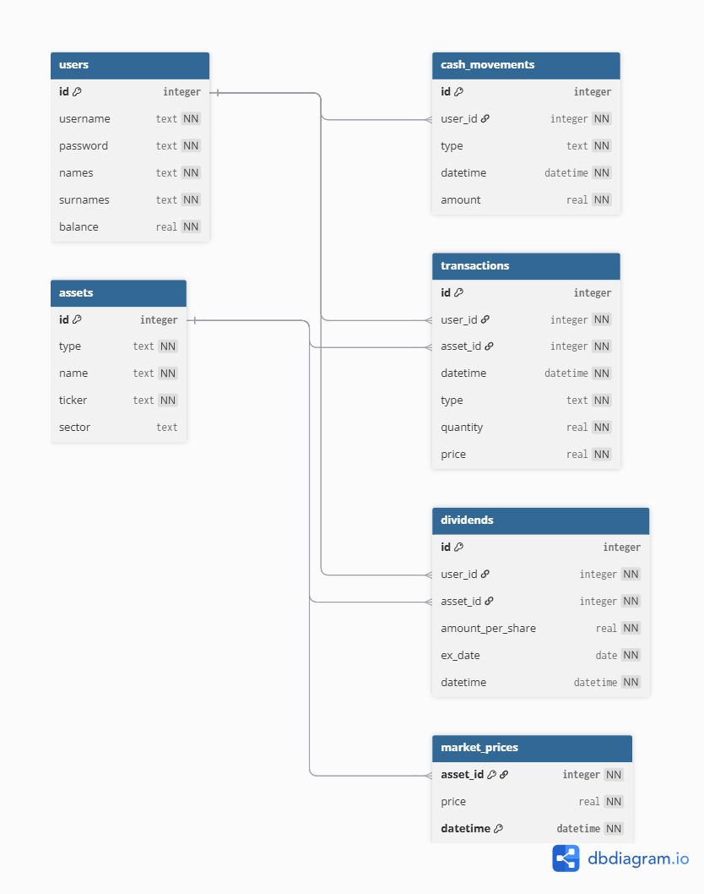

# Portfolio Tracker Database

By Nicolas Fabian Adell

Video overview: [Portolio Tracker Database](https://www.youtube.com/watch?v=Nf53UhuFD7c)

## Description

The purpose of the database is to track and analyze the investment portfolio of multiple users. It has a structured way to store and query information and statistics. This includes asset purchases and sales, dividend payments, market prices over time, realized and unrealized profits, cash deposits and withdrawals, and portfolio performance, allocation and metrics. This database could be useful for several investment companies, banks, brokers, crypto exchanges and even for individual investors.

## Schema

### Contact:
Gmail: nicolas.fabian2005@gmail.com

LinkedIn: nicolas fabian adell

https://www.linkedin.com/in/nicolas-fabian-adell/

GitHub: github.com/nicolasadell
